# Hi, I'm Harsh 👋

ML/DL engineer and data scientist, building open-source tools on the side.

- 🔭 Currently leveling up full-stack skills and system design
- 🧠 Interested in deep learning, computer vision, and system design
- 🏍️ Fun fact: I think faster on two wheels

**Stack:** Python · C++ · C · TensorFlow · Keras · scikit-learn · Pandas · NumPy

---

### Recent activity

*Regenerated daily via [GitHub Actions](.github/workflows/terminal-graph.yml) — pulls straight from the GitHub API, no third-party widgets.*

---

